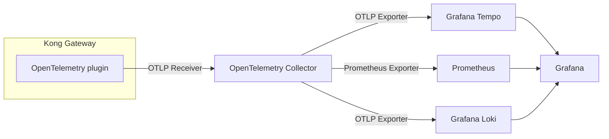

# Kong Observability w/ OSS

This is a sample configuration for experiencing Kong's observability using open-source software(OSS).

## Architecture



## How to use?

Run this script.

```sh
docker compose up -d
```

After that, you can access as follows.

| service      | endpoint                                                         |
| ------------ | ---------------------------------------------------------------- |
| Kong Manager | [http://localhost:8002](http://localhost:8002)                   |
| API          | [http://localhost:8000/mock/uuid](http://localhost:8000/mock/uuid) |
| Grafana      | [http://localhost:3000](http://localhost:3000)                   |
